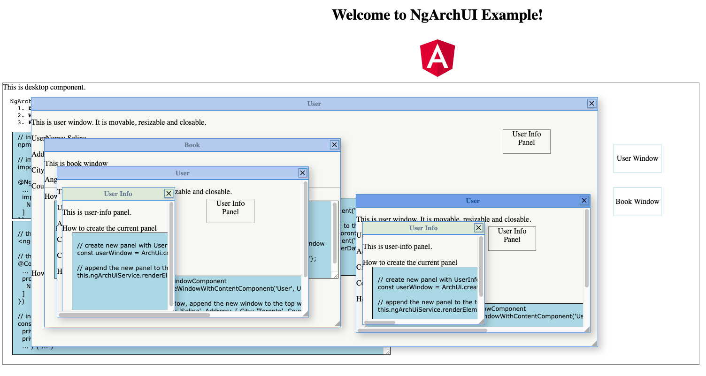

# NgArchUi

Angular window layout. 

<b>NgArchUi</b> implements Window layout. It provides three major ui elements: Desktop, Window and Panel.
  1. <b>Desktop</b> is the root of ui and cannot be removed.
  2. <b>Window</b> contains any number of windows and panels. It can be added and removed.
  3. <b>Panel</b> does not contain other elements. It can be added and removed.

## Demo

<p>The current project example:</p>

<br><br>
<p>NgArch project, https://github.com/samcodex/ngarch-app</p>


## Installation

npm install ng-arch-ui --save

## Usage

### **Firstly, import NgArchUi module and the relative style**
* import module in the AppModule

```
  import { NgArchUiModule } from 'ng-arch-ui';
  ...

  @NgModule({
    ...
    imports: [
      NgArchUiModule
    ]
  })
```

* import angular2-draggable style in angular.json
```
  "styles": [
    ...
    "node_modules/angular2-draggable/css/resizable.min.css"
  ],
```

### **Secondly, use NgArchUiService and NgArchUi component in the host component**
The tag name of NgArchUi entry component is 'ng-arch-ui'. It is the area where the Desktop is located. Put the following code in the host template. 
```
  <ng-arch-ui></ng-arch-ui>
```

  Use the following css to display the Desktop area
```
  ng-arch-ui {
    width: 80%;
    height: 600px;
    border: 1px solid gray;
  }
```

* The main service is called NgArchUIService, and it should be provided in the host component. NgArchUIService can be provided in module level if only one NgArchUi is in the application.
```
  @Component({
    ...
    providers: [
      NgArchUiService
    ]
  })
```

* Inject the require two services: ComponentFactoryResolver and NgArchUiService in the host component.
<p>(NgArchUIService requires the host's ComponentFactoryResolver to dynamically create content component)</p>

```
  constructor(
    private resolver: ComponentFactoryResolver,
    private ngArchUiService: NgArchUiService
    ... 
  ) {
    ... 
  }
```

```
  ngOnInit() {
    ...
    // register resolver
    this.ngArchUiService.registerResolver(this.resolver);

    // assign the content component for the desktop.
    this.ngArchUiService.assignDesktopComponentClass(UiExampleDesktopComponent);
    ...
  }
```

### **Thirdly, create windows and panels on the top element**

* Create new window
```
  // create a new window with UserWindowComponent.
  const userWindow = ArchUi.createWindowWithContentComponent('User', UserWindowComponent);

  // pass the data to the new window
  // the new window is appended to the top element which could be Desktop or Window
  const transferData = { UserName: 'Selina', Address: { City: 'Toronto', Country: 'Canada'}};
  const userWindow = ArchUi.createWindowWithContentComponent('User', UserWindowComponent);
  this.ngArchUiService.renderElementOnTop(userWindow, transferData);
```

* Create new panel
```
  // create a new panel with UserInfoPanelComponent
  const userWindow = ArchUi.createPanelWithContentComponent('User Info', UserInfoPanelComponent);

  // append the new panel to the Desktop or the top Window
  this.ngArchUiService.renderElementOnTop(userWindow);
```

## Public APIs

* ArchUI.createWindowWithContentComponent(title: string, component: Type\<any>)
* ArchUI.createPanelWithContentComponent(title: string, component: Type\<any>)
* NgArchUiService.renderArchUiElement(uiElement: ArchUiElement, 
  transferData: object = null, elementOptions?: NgArchUiElementOptions)
* NgArchUiService.registerResolver(resolver: ComponentFactoryResolver)
* NgArchUiService.assignDesktopComponentClass(clazz: Type\<any>)


## License

MIT
